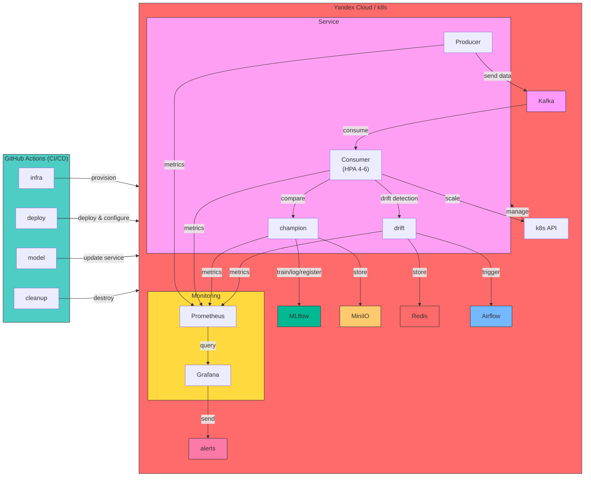
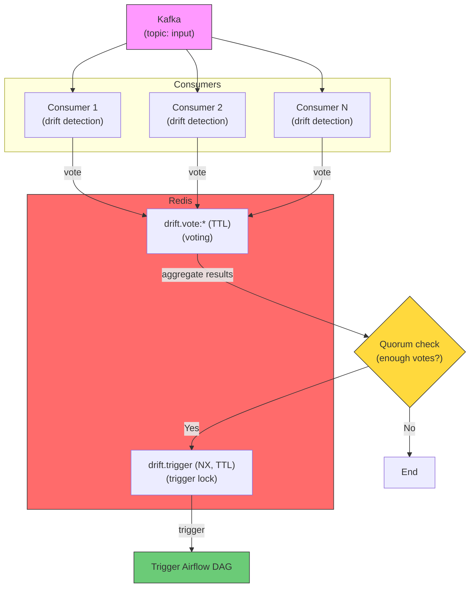
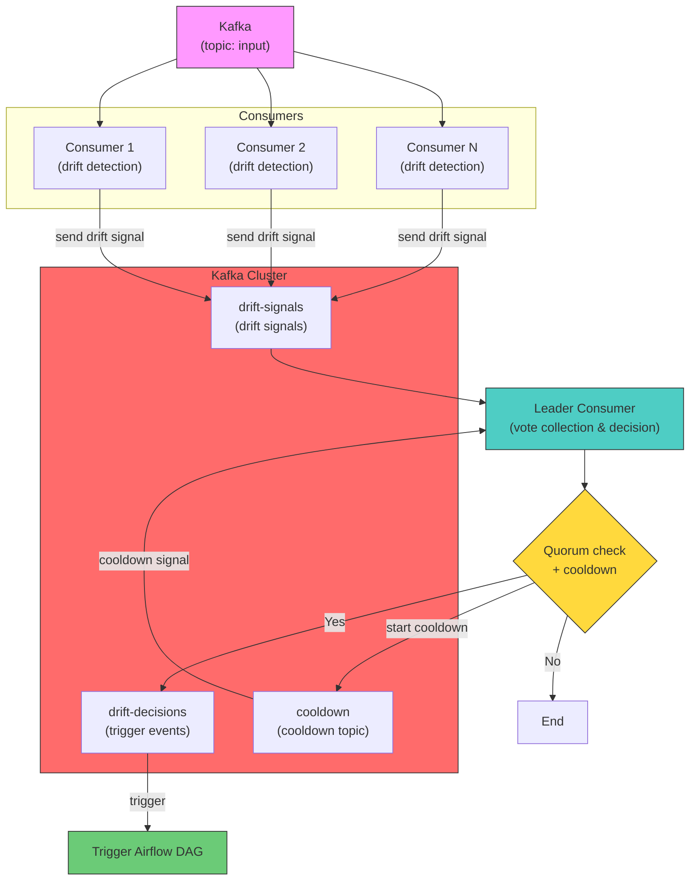

### OTUS Course Final Project
# Kubernetes-based Fraud Detection System in Action

[](https://www.python.org/)
[](https://kafka.apache.org/)
[](https://redis.io/)
[](https://airflow.apache.org/)
[](https://mlflow.org/)
[](https://min.io/)
[](https://www.postgresql.org/)
[](https://www.evidentlyai.com/)
[](https://www.docker.com/)
[](https://kubernetes.io/)
[](https://cloud.yandex.com/)
[](https://www.terraform.io/)
[](https://helm.sh/)
[](https://prometheus.io/)
[](https://grafana.com/)
[](https://github.com/features/actions)
[](https://xgboost.ai/)

## Project Overview

This project implements an end-to-end MLOps pipeline for anti-fraud detection (identifying fraudulent transactions) using streaming data processing, data drift monitoring, and automated model retraining.

The system is built on top of Kubernetes (Managed Service for Kubernetes) and covers the complete ML model lifecycle:
- Data ingestion
- Online inference
- Quality monitoring
- Drift detection
- Automated retraining
- New model deployment
- Manual adjustment of throughput intensity (TPS) and data drift

---

## Architecture

### Main Components

- **Kafka** — data transport (`input` / `predictions` topics), quorum consensus, and locking (`drift-signals` / `drift-decisions` topics)
- **Redis** — voting mechanism, distributed locking
- **Producer** — streams dataset records into Kafka
- **Consumer (HPA 4–6 pods)** — online model inference
- **MLflow** — experiment and model tracking
- **Airflow** — pipeline orchestration
- **Evidently** — data drift monitoring
- **MinIO** — S3-compatible object storage
- **PostgreSQL** — backend storage for Airflow
- **HTTP POST Request to Airflow** — triggers model retraining
- **HTTP POST Request to GitHub** — triggers deployment of the new model version
- **GitHub Actions (GHA)** — automated CI/CD deployment

---

## High-Level Design



---

## Repository Structure

```bash
.
├── k8s/                # Kubernetes manifests for infrastructure
├── dags/               # Airflow DAGs
├── producer/           # Source code for building the producer container image
├── helm/               # Helm charts for producer/consumer
├── monitoring/         # Kubernetes manifests for monitoring stack
├── png/                # Diagrams, images, and visual assets
├── tf/                 # Terraform manifests for cloud provisioning
├── trainer/            # Source code for trainer (model training, A/B testing, publishing)
└── README.md           # This file
```
---
## Data Flow

### 1. Baseline Scenario

- Producer reads `a.csv` from MinIO  
- Sends records into Kafka (`input`)  

**Consumer:**
- Reads messages from Kafka  
- Performs inference  
- Writes results to `predictions`  

**Evidently:**
- Compares the live stream against the baseline reference (`a.csv`)  
- Monitors drift based on a message buffer (default window: 500)

---

### 2. Data Drift & Retraining Trigger

- User updates `helm/producer/values.yaml`:  
  `a.csv → b.csv`  
- Producer begins streaming new data containing pre-configured data drift  
- Evidently detects **data drift**  
- Retraining Airflow DAG is triggered  
- User observes in the monitoring dashboard:
    * Data drift metric shifts from 0 → 1
- User receives notifications in Telegram:
    * Drift state change alert

---

### 3. Retraining Pipeline (Airflow)

**The DAG executes the following steps:**

- Load target dataset from MinIO  
- Train model  
- Log metrics and artifacts to MLflow  
- Validate performance  
- Run A/B test simulation  
- Select champion model  
- Build container image  
- Push to container registry  
- Trigger GitHub Actions workflow  

---

### 4. Deployment

**GHA workflow deploy:**

- Provisions Kubernetes resources  
- Deploys manifests to Kubernetes  
- Updates the inference layer  

**GHA workflow cleanup:**

- Destroys cloud infrastructure  

---

### 5. Load Spikes and Throughput Variations (TPS)

- User updates `helm/producer/values.yaml`:  
  `tps: "5" → "100"`  
- Producer starts emitting messages at a significantly higher TPS rate  
- User observes in the monitoring dashboard:
    * Increase in pod replicas
    * CPU utilization spike
    * Kafka consumer lag growth
- User receives notifications in Telegram:
    * Alert: Kafka lag exceeded threshold
    * Alert: CPU utilization across replicas breached limits

---

 <br>

---

 <br>

---

## Kubernetes Infrastructure

**Deploys the following components:**

- Kafka + Zookeeper  
- PostgreSQL  
- Airflow  
- MLflow  
- MinIO  
- Kafka UI  
- Producer / Consumer workloads  

---

## Monitoring

### OTUS Dashboard

**Monitored Metrics:**
- Data drift status  
- CPU utilization  
- Memory utilization  
- Active pod replica count  
- Kafka lag  
- Throughput (TPS)  
- Fraud detection rate  
- P95 Latency  

---

## ML Model Details

- Task: Binary classification (fraud vs. non-fraud)  
- Algorithm: XGBoost  

**Evaluated Metrics:**
- ROC-AUC  
- Precision / Recall  
- F1-score  
- Custom composite metric: `ROC-AUC + min_inference_time` (used for candidate selection)

---

## Containerization (Docker)

**Containerized Workloads:**

- producer  
- consumer  
- trainer  

---

## Execution Guide

### 1. Prepare GitHub repository, configure secrets, trigger tokens, and environment variables
### 2. Trigger GHA workflows to run `infra` and `deploy` jobs
### 3. Execute the Airflow DAG
### 4. Manually approve the `model` deployment job gate
### 5. Run `cleanup` workflow to tear down cloud resources

---

## Comparison of Two Locking Approaches to Prevent Concurrent Retraining Triggers Upon Data Drift Detection

### Scenario 1: Drift Detection via Redis (Quorum + Lock)


---
### Scenario 2: Drift Detection via Kafka (Leader Election)


---

## Comparative Matrix

| Evaluation Criterion | Redis Approach (`consumer.redis`) | Kafka Approach (`consumer.kafka`) |
|----------------------|-----------------------------------|-----------------------------------|
| **Coordination Mechanism** | Atomic flag assignment in Redis (quorum consensus → `setnx` with TTL) | Leader election via consumer group; leader aggregates votes from `drift-signals` topic |
| **External Dependencies** | Requires Redis instance | Pure Kafka (uses dedicated topics) |
| **Implementation Complexity** | Low (uses standard atomic Redis commands) | Medium/High (handles leader election, dual consumer loops, rebalance handling) |
| **Vote TTL Management** | Handled natively via Redis key expiration (TTL) | Leader manually filters stale votes using event timestamps |
| **Duplicate Trigger Mitigation** | Global `drift:trigger` flag with TTL enforcement | Leader tracks `last_trigger_time` and enforces a cooldown window |
| **Scalability** | `KEYS` scanning operations can become a bottleneck with high pod counts | Scalable via leader delegation, though the single leader node handles evaluation |
| **Tech Stack Homogeneity** | Requires managing and operating a separate Redis cluster | Fully embedded within the Kafka ecosystem (if Kafka is already present) |

---

## Key Takeaways

Both strategies effectively prevent duplicate Airflow DAG triggers when data drift is detected simultaneously across distributed consumers. 

- **Redis implementation** is simpler, leveraging atomic `setnx` (*Set if Not eXists*) operations for global locking alongside TTL auto-cleanup, but introduces a runtime dependency on Redis and `KEYS` lookup operations.
- **Kafka implementation** is fully self-contained (eliminating Redis dependencies) by establishing distributed consensus via a leader consumer and dedicated topics, though it introduces greater architectural and code complexity.

The optimal choice depends on whether Redis is already part of your infrastructure stack and your team's preference regarding system complexity versus stack footprint.


